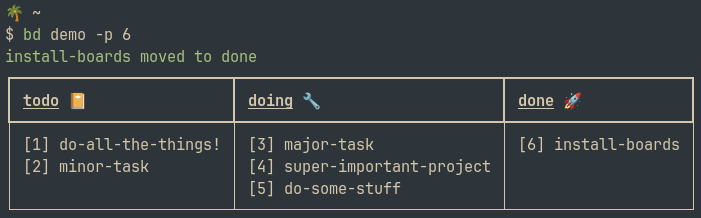

# boards 🏂
*Recursive kanban for the command line*

boards is a cli kanban tool based around the filesystem. A board is a folder with a set config file at the top. By default, items on a kanban board are markdown files, which allows you to attach and edit notes to them. They can be anything though (mp3s if you really want) which means they can also be folders, and those folders can be boards.

You can:
- Just have a normal kanban board
- Have a big project board with subprojects understand
- Have a whole board where every task is secretly a cat picture
- Include a kanban board within a git repository
- Have a board inside a board inside a board
- Have a board inside a board where every task is a board and every task in those boards is an mp3



## Use

After installing the runnable "bd" is available, the first time you run it, it'll create a default user board for you.

You can just type ```bd``` and boards will display your default board (or if your in a folder that is a board, that board).

Commands are based on [clikan](https://github.com/kitplummer/clikan) and all work like this:

```bash
bd [optionally name a board] --long-comand/-l id/name-of-item
```

In the above screenshot, on a board called ```demo```, item number 6 has been "promoted" with ```-p```. This could have been done in a longer form with:

```bash
bd demo --promote install-boards
```

Available commands are:

| Command               | Explanation                            |
|-----------------------|----------------------------------------|
| --promote/-p          | Move the item right one column         |
| --demote/-d           | Move the item left one column          |
| --new/-n              | Create a new item on the board         |
| --notes/--edit/-e     | Open item in a text editor for note    |
| --remove/-r           | Delete item from board                 |
| --make-board/-m       | Make specified item into a board       |
| --init/-i             | Create a new board*                    |
| --help/-h             | Display help message*                  |

*Note that ```--init``` and ```--help``` do not take task names or IDs. ```--init``` takes the name of a folder (or "." for current directory) to create a board in, and ```--help``` takes no arguments.

### Specifying boards / Subboards

Boards can be given aliases, which are specified in you user config file (see next section)

If no board is specified, running ```bd``` will first check to see if you're currently in a "board" folder (i.e. one with the special board.toml config file), and otherwise default to calling the board aliased as "default" (if this doesn't exist an error message will display - it's created by default, but you could remove it from your config).

If you have converted an item into a subboard with ```bd --make-board some-item``` you might be wondering how to actual look at it. You can use "." to make out parent.child boards, for instance:

```bash
bd project.some-subproject --demote an-item
```

## Configuration

### User Configuration

Boards will create a config file when first ran in ~/.config/boards/config.toml.

There aren't many options, it'll look something like this:

```toml
editor = "nvim"

[boards]
default = "/home/me/.config/boards/userboard"
work = "/home/me/Documents/work-board"
```

In the above example, the editor, which defaults to *vi* has been set to *nvim*. Any command line runnable can be set as your editor (*code*, *hx*, *nano*). Alongside the generated default board, another board has been aliased as "work". This means ```bd work``` will no to look in that specied location.

### Board Configuration

When initialised, a *board.config* file will be created. Again, there aren't many options, but it should look like this:

```toml
lanes = ["todo", "doing", "done"]
bin = "archive"

[icons]
todo = "📒"
doing = "🔧"
done = "🚀"
```

"lanes" marks out which folders are considered lanes on your kanban board (as well as the order to display them in). "bin" is the folder into which deleted items will be placed.

Optionally the "icons" section allows you to set additional emojis (or any text) to display next to the lane titles.

## Installation

Boards depends on python, and is otherwse a pip install away with:
```
pip install boards
```

⚠️ Consider using ```pipx install boards``` to install into an isolated environment⚠️

## Inspiration / Similar Projects

This is massively influence by (/copied from) the awesome [clikan](https://github.com/kitplummer/clikan) which I used a lot previously. I started this project when I wanted to have some additional features (notes, recursive boards, multiple boards)